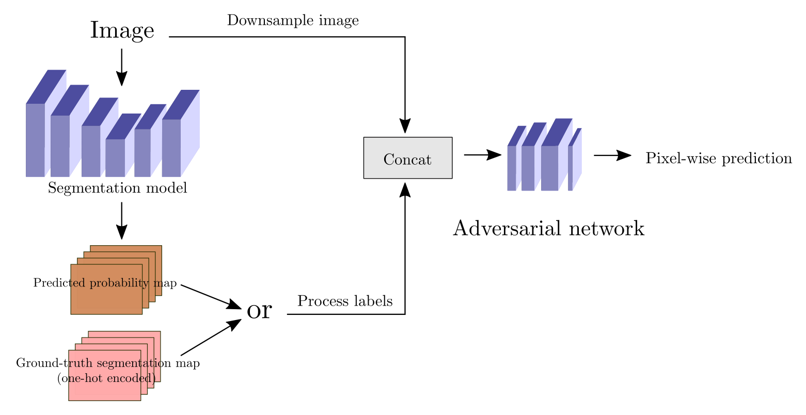

# Novelty Detection using an adversarial training scheme (implemented using tf.keras)
Detecting unknown objects in semantic segmentations is crucial for detecting corner cases in autonomous driving. This problem is far from solved. We propose a novel architecture that implicitly yields novelties.

------
## Requirements

python>=3.6

tensorflow-gpu==1.15.0

tensorflow==1.15.0

h5py==2.10.0

numpy==1.17.4

tqdm==4.40.2

scikit-learn==0.22

------

------
## Dataset

The models are trained on the CityScapes dataset with a particular folder structure:
```
cityscapes
│
└───train
│   └───images
│   │   │   aachen_000001_000019_leftImg8bit.png
│   │   │   ...
│   │      
│   └───classes
│       │   aachen_000001_000019_gtFine_color.png
│       │   ...
│       
│   
└───val
│   └───images
│   │   │   frankfurt_000000_000576_leftImg8bit.png
│   │   │   ...
│   │      
│   └───classes
│       │   frankfurt_000000_001016_gtFine_color.png
│       │   ...
```


------

The repository is organized in the following way. The **model** directory contains our architecture (subsumed in *NoveltyGAN.py*), the **trainers** directory contains our training schedule. 
Training hyperparameters are set in the .json files in the **configs** directory. Training can be started using **python mains/main.py**

## Architecture



